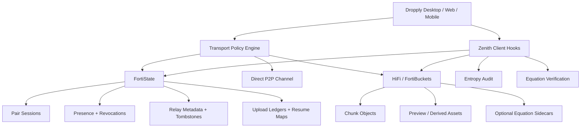

# Dropply Unified Substrate Blueprint

Last updated: 2026-04-27

This document is the opinionated integration blueprint for making Dropply, FortiState, HiFi/FortiBuckets, and Zenith work as one coherent system instead of four adjacent ideas.

It is intentionally practical. It describes what each layer should own, where each one should not be forced, and the safest rollout path from today’s Dropply into a stronger release-grade platform.

## 1. Assumptions

This blueprint assumes:

- **Dropply** is the product and client/runtime owner.
- **FortiState** is the local state kernel first, and can also back a stronger distributed coordination layer when paired with a remote state service.
- **HiFi / FortiBuckets** is the durable object/blob layer.
- **Zenith** is the deterministic synthesis and integrity layer.

Current repo truth:

- Dropply already has real relay blob chunking and FortiBuckets-backed blob persistence.
- Dropply already has optional Zenith verification hooks in the desktop import/export path.
- Dropply now has an embedded FortiState-style kernel in the backend runtime.
- Dropply desktop, hosted web, and backend now share that kernel through one local package import: `@dropply/fortistate-kernel`.
- Dropply now also has a concrete remote state service scaffold under `private-components/state-service`.
- Dropply does **not** yet have a proven production-grade shared remote state service behind that runtime.

## 2. Current truth

Today Dropply is strongest in these areas:

- local-first desktop ownership
- direct `p2p` media transfer
- relay blob durability
- paired-device workflow

Today Dropply is still weakest in these areas:

- multi-node backend coordination
- resumable state authority across instances
- durable signaling/presence/session mutation
- policy-grade transport orchestration

That means the right “best possible” architecture is **not** to jam Zenith everywhere first.

The right order is:

1. make shared state authoritative
2. keep blobs durable and content-addressable
3. use Zenith where it actually helps instead of where it sounds impressive

## 3. Recommended ownership model

### Dropply should own

- UX
- local-first storage
- pair and device identity at the client edge
- transport selection policy
- chunk scheduling
- direct-transfer runtime
- download and import/export behavior

### FortiState should own

- pairing sessions
- device registry
- revoked-device ledger
- presence / last-seen
- WebRTC signaling queues
- relay item metadata
- relay chunk upload ledgers
- resumable-upload maps
- tombstones and deletion ordering
- plan counters and quotas

### HiFi / FortiBuckets should own

- immutable chunk bytes
- derived preview assets
- encrypted-at-rest media bodies
- retention lifecycle
- cross-instance blob durability
- content-addressed dedupe opportunities

### Zenith should own

- integrity proofs
- entropy classification
- “should synthesize vs should bypass” decisions
- sidecar causal equations for eligible content
- deterministic reconstruction verification

## 4. The clean answer to “Zenith in HiFi or HiFi in Zenith?”

### Best answer

Neither should “contain” the other in the primary design.

They should be layered:

- FortiState coordinates
- HiFi stores bytes
- Zenith produces and verifies sidecar intelligence about those bytes
- Dropply orchestrates the product behavior on top

### Good pattern

**Zenith alongside HiFi**

Meaning:

- the blob lives in HiFi / FortiBuckets
- the hash, entropy score, equation metadata, and reconstruction hints live as metadata
- Dropply chooses whether to fetch raw bytes, equation sidecar, or both

### Bad pattern

**HiFi inside Zenith**

Why it is bad:

- it makes object storage depend on a specialized synthesis engine
- it couples basic durability to advanced math
- it makes every blob path pay a complexity tax even when the file is not a good Zenith candidate

### Bad pattern

**Zenith as the default transport for all media**

Why it is bad right now:

- current Zenith code in this repo is a real integrity layer, but not a proven production default for arbitrary video/file payload transport
- large binary media is often high entropy or pre-compressed
- the repo’s own entropy heuristic already says to bypass synthesis for those cases

## 5. Best unified architecture



## 6. What each layer should do in Dropply

## 6.1 FortiState in Dropply

FortiState should become the backend’s authoritative state adapter.

That means replacing the current JSON-file-centered session store with an interface like:

```ts
type PairStateStore = {
  getSession(token: string): Promise<PairSession | null>;
  putSession(session: PairSession): Promise<void>;
  patchDevice(token: string, device: PairDevice): Promise<void>;
  revokeDevice(token: string, targetDeviceId: string): Promise<void>;
  appendSignal(token: string, targetDeviceId: string, signal: SignalMessage): Promise<void>;
  pullSignals(token: string, deviceId: string): Promise<SignalMessage[]>;
  upsertRelayItem(token: string, item: RelayItem): Promise<void>;
  getRelayItem(token: string, itemId: string): Promise<RelayItem | null>;
  putBlobLedger(token: string, ledger: RelayBlobLedger): Promise<void>;
  getBlobLedger(token: string, itemId: string): Promise<RelayBlobLedger | null>;
};
```

FortiState’s biggest wins for Dropply:

- real multi-instance session consistency
- resumable uploads that survive backend restarts
- stronger revocation behavior
- stable signaling queues
- safer future account/device graphs

## 6.2 HiFi / FortiBuckets in Dropply

HiFi / FortiBuckets should stay the durable byte plane.

For Dropply, that means:

- every large relay media object becomes a chunked object set
- chunk keys become content-addressed where possible
- the backend stores only descriptors, not giant inline base64
- preview assets can be stored separately from source media

Recommended object model:

- `chunks/<sha256>/<chunk-index>`
- `items/<item-id>/manifest.json`
- `derived/<item-id>/thumb.webp`
- `derived/<item-id>/preview.mp4`
- `equations/<item-id>/<version>.json`

That gives us:

- dedupe opportunities
- smaller state records
- clearer cleanup
- easier partial reconstruction

## 6.3 Zenith in Dropply

Zenith should be used in **three** places first.

### 1. Integrity sidecar

For any item that has a useful Zenith equation:

- generate equation sidecar
- attach entropy score
- attach equation weight
- attach verification status

This should live as metadata beside the blob, not replace the blob.

### 2. Eligibility classifier

Before upload or relay optimization:

- run entropy heuristic
- classify the payload as:
  - `structured`
  - `compressible-media`
  - `high-entropy`
  - `already-compressed`

Then Dropply chooses:

- raw chunk relay
- raw + equation sidecar
- equation-first with raw fallback

### 3. Verification on import

When an item is imported:

- verify raw chunk digest
- if equation sidecar exists and is marked usable, verify Zenith reconstruction too

This gives Dropply a higher-assurance import path without making the app depend on synthesis for ordinary success.

## 7. What not to do

These are the traps to avoid.

### Do not make Zenith mandatory for all files

Large MP4s, ZIPs, PDFs, and random binary assets are exactly the content most likely to hit the entropy bypass path.

### Do not store big media in FortiState

FortiState should hold descriptors and ledgers, not media bodies.

### Do not let HiFi decide session semantics

Object storage should not be the authority for:

- device revocation
- tombstones
- pairing state
- signaling queues

### Do not let Dropply clients independently invent state truth

The client can cache and optimize, but session truth should come from FortiState once it exists.

## 8. Best path by content type

## 8.1 Text

Best path:

- FortiState primary
- optional Zenith equation
- HiFi optional for large text attachments only

Why:

- text is small, structured, and state-heavy
- it benefits more from coordination than blob durability

## 8.2 Small images

Best path:

- direct `p2p` when available
- HiFi/FortiBuckets relay blob when needed
- optional Zenith sidecar for structured image classes or previews

Why:

- image transfer already works well chunked
- Zenith may help for some image-derived artifacts, but shouldn’t block the normal path

## 8.3 Video

Best path:

- direct `p2p` preferred
- HiFi/FortiBuckets chunk relay second
- FortiState tracks ledger, manifest, progress, preview readiness
- Zenith only for verification sidecars or preview-derivative workflows

Why:

- most video payloads should bypass synthesis
- the real win is durable chunking plus resumability, not forcing equation transport

## 8.4 Arbitrary files

Best path:

- FortiState metadata
- HiFi/FortiBuckets chunks
- Zenith bypass by default unless entropy and format say otherwise

Why:

- generic file transfer should prioritize correctness and resumability over experimental compression/synthesis

## 9. Security model for the unified stack

If the goal is “best while staying secure,” the stack should be:

### FortiState

- authoritative session writes
- signed mutation records
- short-lived device capability tokens
- replay-safe delete and revoke semantics

### HiFi / FortiBuckets

- encrypted-at-rest media objects
- private bucket access
- object keys never exposed as raw public URLs
- signed fetch / write delegation when needed

### Zenith

- raw-state digest verification
- equation verification where present
- entropy-based bypass to avoid false confidence on bad candidates

### Dropply client

- never treat a media item as valid until either:
  - raw digest verifies, or
  - raw digest plus Zenith verification both pass

## 10. Phased rollout plan

## Phase 1: FortiState first

Goal:

- remove JSON file as the authoritative hosted state layer

Work:

- add `PairStateStore` interface
- keep `JsonPairStateStore` as local fallback
- add `FortiStatePairStateStore`
- move:
  - devices
  - signals
  - relay item metadata
  - blob ledgers
  - tombstones
  - revocations

This is the highest-value step.

## Phase 2: Blob descriptors and dedupe

Goal:

- make HiFi / FortiBuckets the clean content plane

Work:

- persist object manifests
- move blob metadata out of giant session objects
- use content-addressed chunk keys where possible
- track derived previews

This tightens durability and reduces duplicated work.

## Phase 3: Zenith sidecars

Goal:

- improve assurance and intelligent routing without destabilizing media transfer

Work:

- store entropy score
- store optional equation sidecar
- verify on import
- expose a `zenithEligible` / `zenithBypassed` flag

This is the safest first Zenith rollout.

## Phase 4: Zenith-aware transport optimization

Goal:

- selectively reduce bandwidth or storage for the kinds of payloads Zenith is genuinely good at

Work:

- add content-profile rules
- allow equation-first sync for specific structured data classes
- keep raw-fallback path mandatory

This should happen only after the first three phases are stable.

## 11. Concrete repo changes to make next

### Backend

- create `private-components/backend/src/stateStore.ts`
- move session logic behind an interface
- split blob ledger metadata out of `pairSessions.ts`
- let `/v1/relay/blob/status` read ledgers from the state adapter

### Desktop Rust

- extend Zenith metadata export from a best-effort field to a richer sidecar descriptor:
  - entropy score
  - zenith eligibility
  - equation weight
  - verification method version

### Web / desktop clients

- add richer transfer policy labels:
  - `direct`
  - `relay`
  - `resuming`
  - `verified`
  - `zenith-bypassed`
  - `zenith-verified`

### Documentation

- update masterbook after each phase
- keep this file as the architectural truth for the unified stack

## 12. The recommendation

If the goal is to make Dropply “the best,” the strongest integrated shape is:

- **Dropply** as the product shell and policy engine
- **FortiState** as the authoritative shared state layer
- **HiFi / FortiBuckets** as the durable byte plane
- **Zenith** as the selective verification and synthesis sidecar

Not:

- Zenith replacing blob transport for everything
- object storage pretending to be the session database
- the client inventing state truth on its own

## 13. Bottom line

The best version of Dropply is:

- local-first at the edge
- state-authoritative in FortiState
- byte-durable in HiFi / FortiBuckets
- selectively smarter with Zenith

That stack gives Dropply:

- better large-media reliability
- real multi-node backend behavior
- stronger revoke/resume semantics
- better long-term transport intelligence
- high security without overcomplicating the default happy path

If we are optimizing for the best next implementation move, the answer is:

**put FortiState under Dropply first, keep HiFi as the blob plane, and add Zenith as a sidecar intelligence layer before making it a core transport primitive.**
